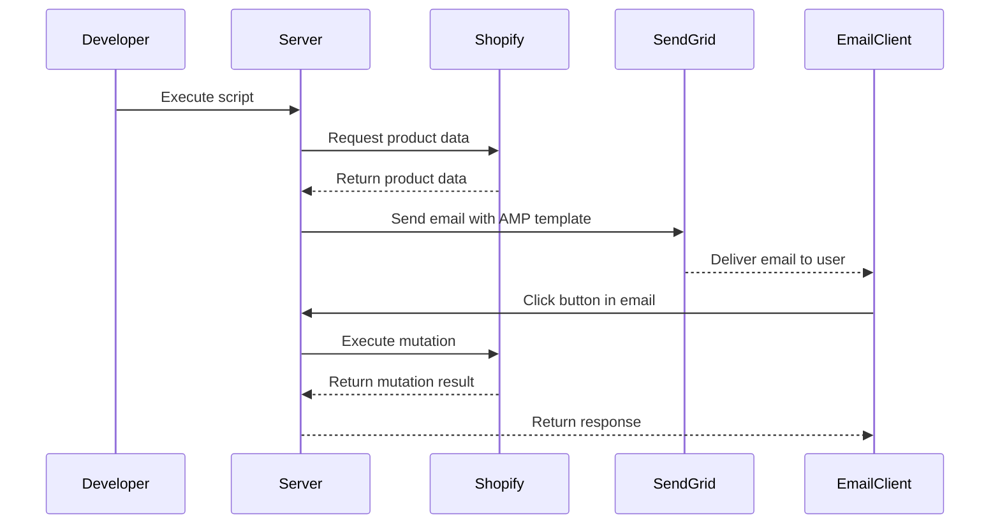

# amp-shopify-playground

AMP for GmailでのShopify連携（カート追加）を検証するためのレポジトリです。

- Node.js(v23.5.0)
- Server Framework: [Hono](https://hono.dev/)
- Hosting: [Vercel](https://vercel.com/)

### Sequence



1. Developerがスクリプトを実行しサーバーからStorefront APIを経由してShopifyから商品情報を取得
1. 取得した商品情報をサーバーにてAMPテンプレート記法に埋め込んでSendGrid v3 APIを使ってメール送信
1. メールクライアント内のボタンをクリックしREST APIでサーバにリクエスト
1. リクエストを受け取ったサーバーはStorefront APIのmutation処理を実行しメールクライアントへ結果を返却

※便宜上スクリプト実行にしているが本来は定期バッジや管理サイトなどからサーバーを叩くイメージ

## Setup

### `.env`に以下の情報を記載し作成

```bash
SHOPIFY_STORE_URL="[YOUR_SHOPIFY_STORE_URL]"
SENDGRID_API_KEY="[YOUR_SENDGRID_API_KEY]"
```

### 依存関係のインストール

```bash
pnpm install
```

### Vercelアカウントの作成

ローカルサーバーの起動およびデプロイに[Vercel](https://vercel.com/)のアカウントが必要となります。

## Usage

### ローカルサーバーの起動

サーバー実装は`./server`に記載されています。

```bash
cd server
npm run start
```

### スクリプトの実行

AMPメールの送信は`./script`に記載されています。

```bash
cd script
npm run exec
```

## Shopifyの事前知識

- BASEやSTORESのようにShopifyも同様に知識や経験がない初心者でも簡単にECサイトを立ち上げることができるサービス
- サイトテーマやブログなど多数のテンプレートが用意されておりGUIポチポチでECサイトを構築できる
- WordpressなどのCMSのEC版
- CMS同様にカスタマイズ性に乏しい課題があるが、ShopifyはHeadless APIなど多数のAPIが用意されており柔軟なカスタマイズをすることも可能

## API調査

### Admin API

- [GraphQL Admin API reference](https://shopify.dev/docs/api/admin-graphql)
- アプリや外部サービスをShopifyストアと連携するのに利用するAPI

> The Admin API lets you build apps and integrations that extend and enhance the Shopify admin.
Shopify管理画面をより効率化するためのAPIに思える

### Storefront API

- [Storefront API reference](https://shopify.dev/docs/api/storefront)
  - ref. [Docs](https://github.com/Shopify/shopify-app-js/tree/main/packages/api-clients/storefront-api-client#readme)
- Shopifyストアの外でもショッピング体験を作ることができるAPI
  - 例）他のサイトで購入したアイテムをカートに追加するなど
- Headless Commerceと呼ばれるもの
  - Wordpressのカスタマイズ性に乏しい面への対策として、バックエンド機能だけを切り出したHeadless CMSがあるが、それと同様にECサイトのバックエンドのみを切り出したもの。カート追加やチェックアウト、商品情報の取得など、ECサイトの裏側で必要となる処理を提供
  - HeadlessなのでフロントはNext.jsやモバイルアプリ、AMPメールなど自由に使うことが可能

#### Ajax API

- Shopifyサイトに閉じた世界でより高度にカスタマイズしたい人向けのAPI
- いわゆる`/cart/add.js`とかそういった類のもの
- あくまでShopifyサイトからアクセスすることを前提にしているものでカスタマーのブラウザセッションを元にカート追加などの機能を提供している様子
  - > You can use the Storefront API to interact with a cart during a customer's session.
- [Cart API reference](https://shopify.dev/docs/api/ajax/reference/cart)
  - >The Cart API is used to interact with a cart during a customer's session.

参考: ドメイン外から叩こうとすると普通に実行するCORSで弾かれるのでやはりShopifyサイト内での利用に限定している様子。

> [amp-form] Form submission failed: Error: Request viewerRenderTemplate failed: Error: Class$obf__10: Access to fetch at 'https://[YOUR_DOMAIN]/cart/add.js' from origin 'https://mail.google.com' has been blocked by AMP CORS policy: No 'Access-Control-Allow-Origin' header is present on the requested resource.

## CORSについて

[CORS in AMP for Email](https://amp.dev/documentation/guides-and-tutorials/email/learn/cors-in-email)記載の通りであるが、Version2ではXHRを投げる際に`AMP-Email-Allow-Sender`に`from`アドレスをレスポンスヘッダーにつけて返す必要がある。

- GmailからのXHRはリクエストヘッダーに`AMP-Email-Sender: [送信元アドレス]`が自動で付与される
- サーバーからのレスポンスヘッダーに`AMP-Email-Allow-Sender: [送信元アドレス]`をミドルウェアでつけて返却する

```yaml
# Request Header
AMP-Email-Sender: sender@company.example

# Response Header
AMP-Email-Allow-Sender: sender@company.example
```

## `<amp-form>`のリダイレクトについて

Website版であれば[Redirecting after a submission](https://amp.dev/documentation/components/amp-form#redirecting-after-a-submission)記載の通り、レスポンスヘッダーに以下を返せば実現できルトの記載あり。

```sh
AMP-Redirect-To: https://example.com/forms/thank-you
Access-Control-Expose-Headers: AMP-Redirect-To
```

ただしemail版（AMP for Email）では[Component-specific considerations](https://amp.dev/documentation/guides-and-tutorials/email/learn/email-spec/amp-email-format#component-specific-considerations)記載の通り、`<amp-form>`でのリダイレクトは禁止されている（[日本語サイトではRedirectの記載も残っている](https://amp.dev/ja/documentation/components/email/amp-form#%E9%80%81%E4%BF%A1%E5%BE%8C%E3%81%AE%E3%83%AA%E3%83%80%E3%82%A4%E3%83%AC%E3%82%AF%E3%83%88)が英語ドキュメントの方が正しそうである）。

>Redirects in <amp-form> are disallowed at runtime.

試しに上記のレスポンスヘッダー対応をし以下をレスポンスしてみたが、Hello World!を表示するだけで特にリダイレクトは走らなかった（`AMP-Redirect-To`は機能しなかった）。

```ts
return c.json(
    { message: 'Hello, World!' },
    {
      headers: {
        'AMP-Redirect-To': 'https://hono.dev/',
      },
    }
  )
```

## ユーザに成り代わって商品をカート追加する方法

結論、認証はユーザー操作が必要なので王道のイメージではできない気がする。

追記: これでできそうかも？
[Create and update a cart with the Storefront API](https://shopify.dev/docs/storefronts/headless/building-with-the-storefront-api/cart/manage)

### `cartBuyerIdentityUpdate`が使えない理由

- 顧客カート更新であれば[`cartBuyerIdentityUpdate`](https://shopify.dev/docs/api/storefront/2024-04/mutations/cartbuyeridentityupdate)が用意されているが、これは`buyerIdentity`に`customerAccessToken`を指定する必要がある。
- `customerAccessToken`の取得には[`customerAccessTokenCreate`](https://shopify.dev/docs/api/storefront/2024-10/mutations/customeraccesstokencreate)ミューテーションで生成する必要があり、入力には顧客のemailとpasswordの指定が必要（つまり顧客の操作なしでは実行不可）
- 設計上顧客のカートの中身を勝手に弄ることは許されていないのだろう

## VS Code Extension

- [amphtml-validator - Visual Studio Marketplace](https://marketplace.visualstudio.com/items?itemName=amphtml.amphtml-validator)

## References

- [shopify_flutter | Flutter package](https://pub.dev/packages/shopify_flutter)
  - モバイルアプリ（Shopifyの外の世界）でどうやって実装するものなのかを知るのが理解早い。
